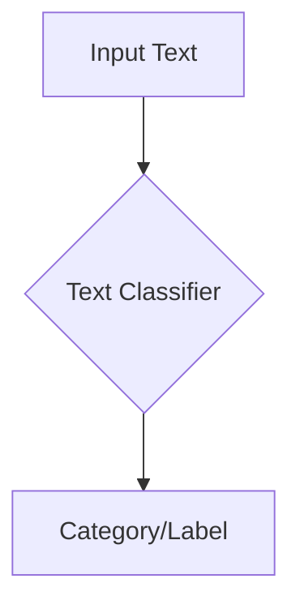
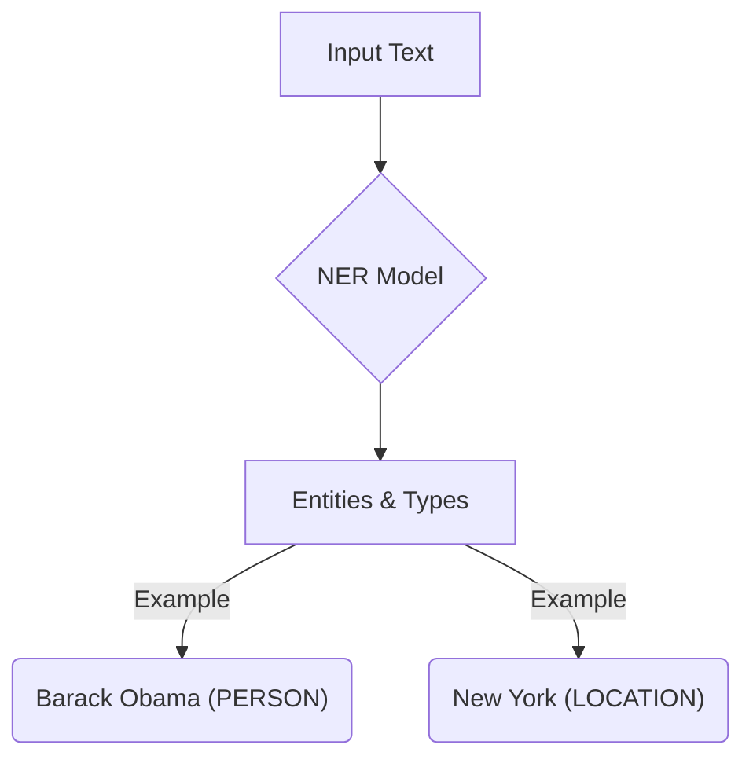
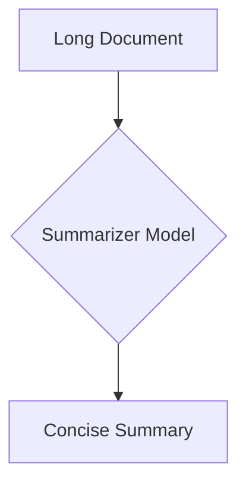

# Common NLP Tasks

:::info[Purpose]
Explore a range of prevalent tasks that Natural Language Processing systems are designed to address.
:::

## Introduction to NLP Applications

NLP has a vast array of applications, each tackling a specific challenge related to understanding or generating human language. These tasks often serve as building blocks for more complex AI systems.

## Key NLP Tasks

### 1. Text Classification

**What it is**: Assigning a predefined category or label to a piece of text.

**Diagram**:


**Common Uses**:
- **Spam Detection**: Classifying emails as spam or not spam.
- **Topic Categorization**: Grouping news articles by subject (e.g., "sports", "politics").
- **Genre Classification**: Identifying the genre of a book or movie script.

**Code Example (Conceptual)**:
```python
def classify_text(text: str) -> str:
    """
    A conceptual function to classify text into predefined categories.
    In a real-world scenario, this would involve a trained machine learning model.
    """
    text_lower = text.lower()
    if "spam" in text_lower or "lottery" in text_lower:
        return "Spam"
    elif "politics" in text_lower or "government" in text_lower:
        return "Politics"
    elif "sports" in text_lower or "football" in text_lower:
        return "Sports"
    else:
        return "General"

print(f"'Win a free lottery!' is classified as: {classify_text('Win a free lottery!')}")
print(f"'The local team won the championship.' is classified as: {classify_text('The local team won the championship.')}")
print(f"'Government announces new policy.' is classified as: {classify_text('Government announces new policy.')}")
```

### 2. Sentiment Analysis (Opinion Mining)

**What it is**: Determining the emotional tone or sentiment expressed in a piece of text (e.g., positive, negative, neutral).

**Common Uses**:
- **Customer Feedback Analysis**: Understanding customer opinions about products or services from reviews and social media.
- **Brand Monitoring**: Tracking public sentiment towards a brand.
- **Political Polling**: Analyzing public opinion on political issues.

### 2. Sentiment Analysis (Opinion Mining)

**What it is**: Determining the emotional tone or sentiment expressed in a piece of text (e.g., positive, negative, neutral).

**Diagram**:
```mermaid
graph TD
    A[Input Text] --> B{Sentiment Analyzer};
    B --> C[Sentiment (Positive/Negative/Neutral)];
```

**Common Uses**:
- **Customer Feedback Analysis**: Understanding customer opinions about products or services from reviews and social media.
- **Brand Monitoring**: Tracking public sentiment towards a brand.
- **Political Polling**: Analyzing public opinion on political issues.

**Code Example (Conceptual)**:
```python
def analyze_sentiment(text: str) -> str:
    """
    A conceptual function to analyze the sentiment of a text.
    In a real-world scenario, this would involve a trained model or lexicon-based approach.
    """
    text_lower = text.lower()
    positive_words = ["great", "excellent", "love", "happy", "fantastic"]
    negative_words = ["bad", "terrible", "hate", "unhappy", "awful"]

    score = 0
    for word in text_lower.split():
        if word in positive_words:
            score += 1
        elif word in negative_words:
            score -= 1

    if score > 0:
        return "Positive"
    elif score < 0:
        return "Negative"
    else:
        return "Neutral"

print(f"'This product is fantastic!' sentiment: {analyze_sentiment('This product is fantastic!')}")
print(f"'I am very unhappy with the service.' sentiment: {analyze_sentiment('I am very unhappy with the service.')}")
print(f"'The weather is okay today.' sentiment: {analyze_sentiment('The weather is okay today.')}")
```

### 3. Named Entity Recognition (NER)

**What it is**: Identifying and classifying named entities in text into predefined categories such as person names, organizations, locations, dates, monetary values, etc.

**Common Uses**:
- **Information Extraction**: Automatically populating databases from unstructured text.
- **Content Categorization**: Indexing documents by entities mentioned.
- **Search Enhancement**: Improving search results by recognizing entities in queries.

### 3. Named Entity Recognition (NER)

**What it is**: Identifying and classifying named entities in text into predefined categories such as person names, organizations, locations, dates, monetary values, etc.

**Diagram**:


**Common Uses**:
- **Information Extraction**: Automatically populating databases from unstructured text.
- **Content Categorization**: Indexing documents by entities mentioned.
- **Search Enhancement**: Improving search results by recognizing entities in queries.

**Code Example (Conceptual)**:
```python
import re

def perform_ner(text: str) -> dict:
    """
    A conceptual function to perform Named Entity Recognition.
    In a real-world scenario, this would involve a trained NER model (e.g., SpaCy, NLTK's `ne_chunk`).
    This simple example uses regex for illustrative purposes.
    """
    entities = {
        "PERSON": [],
        "LOCATION": [],
        "ORGANIZATION": []
    }

    # Simple regex-based detection for demonstration
    # This is highly simplistic and not robust for real-world use
    persons = re.findall(r"(Mr\.|Ms\.|Dr\.)\s([A-Z][a-z]+)", text)
    if persons:
        entities["PERSON"].extend([f"{title} {name}" for title, name in persons])

    locations = re.findall(r"in (New York|London|Paris|Tokyo)", text)
    if locations:
        entities["LOCATION"].extend(locations)

    organizations = re.findall(r"(Google|Microsoft|Apple|OpenAI)", text)
    if organizations:
        entities["ORGANIZATION"].extend(organizations)

    return entities

sample_text = "Dr. Jane Doe works at Google in New York."
print(f"Entities in '{sample_text}': {perform_ner(sample_text)}")

sample_text_2 = "Mr. John Smith visited London."
print(f"Entities in '{sample_text_2}': {perform_ner(sample_text_2)}")
```

### 4. Machine Translation (MT)

**What it is**: Automatically translating text or speech from one natural language to another while preserving its meaning.

**Common Uses**:
- **Cross-Lingual Communication**: Facilitating communication between speakers of different languages.
- **Globalization**: Adapting content for international audiences.

### 5. Text Summarization

**What it is**: Creating a concise and coherent summary of a longer text document while retaining the most important information.

**Types**:
- **Extractive Summarization**: Identifies and extracts key sentences or phrases directly from the original text.
- **Abstractive Summarization**: Generates new sentences that capture the main ideas, potentially using words not present in the original text.

**Diagram**:


**Common Uses**:
- **News Briefs**: Generating short summaries of news articles.
- **Document Overview**: Providing quick insights into lengthy reports.

**Code Example (Conceptual Extractive Summarization)**:
```python
from collections import defaultdict
from nltk.tokenize import sent_tokenize, word_tokenize
from nltk.corpus import stopwords
import string

def summarize_text_extractive(text: str, num_sentences: int = 2) -> str:
    """
    A conceptual function to perform extractive text summarization.
    This simple example scores sentences based on word frequency.
    """
    sentences = sent_tokenize(text)
    if len(sentences) <= num_sentences:
        return text

    word_frequencies = defaultdict(int)
    stop_words = set(stopwords.words('english'))
    punctuations = set(string.punctuation)

    for sentence in sentences:
        for word in word_tokenize(sentence.lower()):
            if word not in stop_words and word not in punctuations:
                word_frequencies[word] += 1

    # Calculate weighted frequency for each sentence
    sentence_scores = defaultdict(int)
    for i, sentence in enumerate(sentences):
        for word in word_tokenize(sentence.lower()):
            if word in word_frequencies:
                sentence_scores[i] += word_frequencies[word]

    # Get the top N sentences based on score
    sorted_sentences = sorted(sentence_scores.items(), key=lambda x: x[1], reverse=True)
    top_sentences_indices = [idx for idx, _ in sorted_sentences[:num_sentences]]
    top_sentences_indices.sort() # Maintain original order

    return " ".join([sentences[idx] for idx in top_sentences_indices])

sample_text = """
Natural Language Processing (NLP) is a field of artificial intelligence that gives computers the ability to understand human language.
This understanding is crucial for machines to interact with humans in a more natural way.
NLP combines computational linguistics—rule-based modeling of human language—with statistical, machine learning, and deep learning models.
Many challenges in NLP involve speech recognition, natural language understanding, and natural language generation.
Applications of NLP include sentiment analysis, machine translation, and text summarization.
It is a rapidly evolving field with new advancements constantly emerging.
"""

summary = summarize_text_extractive(sample_text, num_sentences=3)
print("Original Text:\n", sample_text)
print("\nSummary:\n", summary)
```

### 6. Question Answering (QA)

**What it is**: Automatically answering questions posed in natural language based on a given text or knowledge base.

**Common Uses**:
- **Chatbots and Virtual Assistants**: Providing direct answers to user queries.
- **Information Retrieval**: Quickly finding specific information within large document collections.

### 7. Part-of-Speech (POS) Tagging

**What it is**: Labeling words in a text as corresponding to a particular part of speech, such as noun, verb, adjective, adverb, etc.

**Common Uses**:
- **Syntactic Analysis**: A foundational step for more advanced grammatical parsing.
- **Word Sense Disambiguation**: Helping to determine the correct meaning of a word based on its grammatical role.
